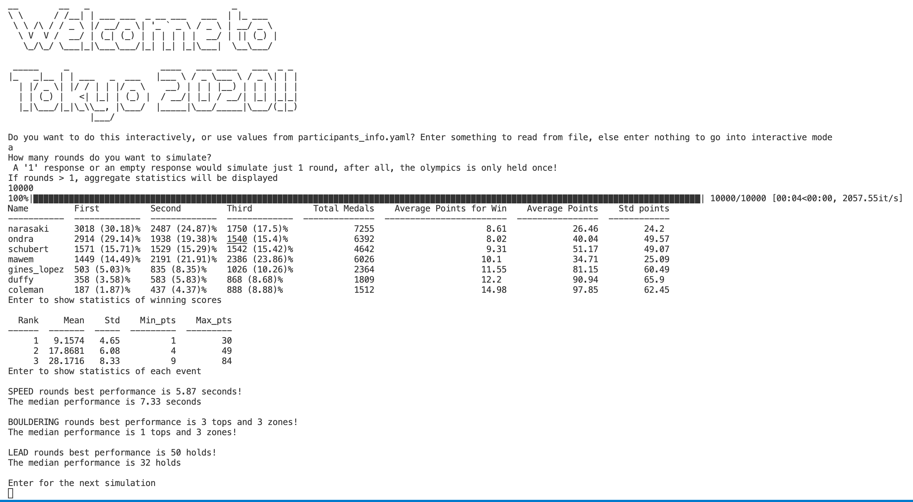

# Virtual simulator for Tokyo 2020 Sport Climbing event - combined format.

Motivation: Due to the multiplicative nature of scoring, there is much uncertainty over the climber who will come up on top, with the top positions often changing places in a single event or even climb. This simulation hopes to capture the nature of this uncertainty, and also find out the aggregated relative rankings of climbers through multi-round simulation.

##  How it works
- The combined format's ranking multiplies the ranking of each athlete over 3 events, and the athlete's are then than ranked by their overall scores in ascending order.
- Speed is simulated as a best time format, rather than atheletes competing head-to-head, since inital seeds from quals are not provided here.
- Bouldering is a simulation of atheletes' attempts in 3 boulders, which are set as the types - slab, dynamic, traditional, respectively
- Lead is simulated as a step by step completion of each hold, with a possibiity of slipping at each hold.

## Usage
### Input for competitors:
Either put your favorite competitor's information into `participants_info.yaml` or input the values via the interactive mode.

### Input for routesetters:
To set the range of difficulties for each stage, aspriring routesetters should look to `config.yaml`

### Simulating
You may choose to simulate either one round, or mulitple rounds.

One round:

Multiple rounds:

